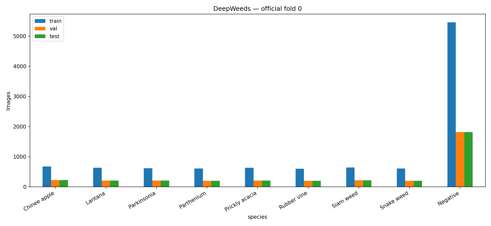
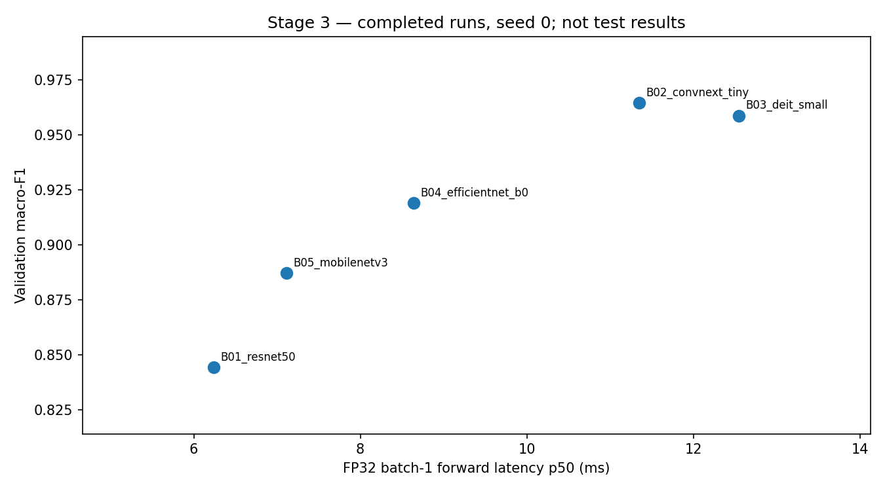
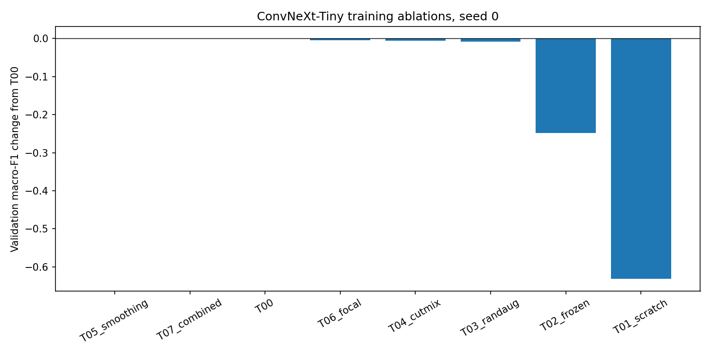
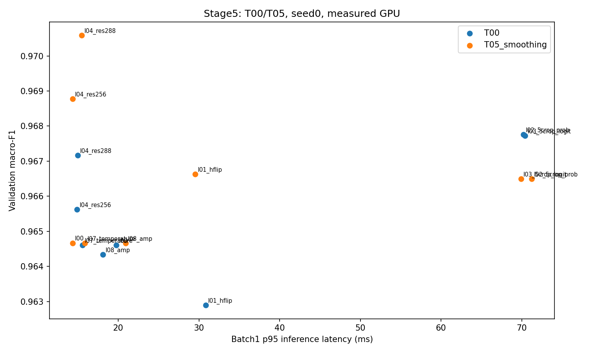
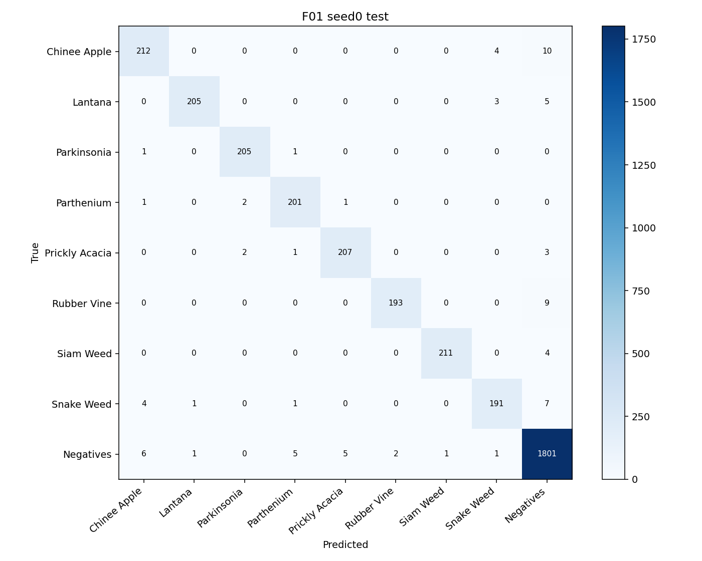
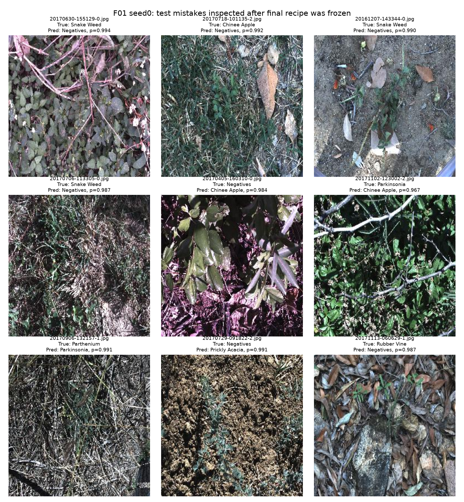
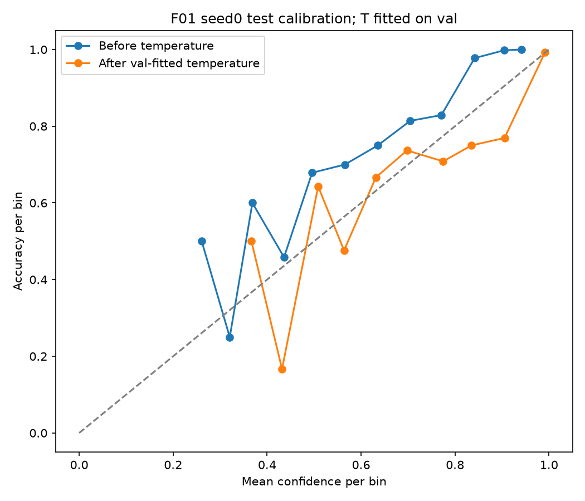

# DeepWeeds: kiến trúc, công thức huấn luyện và suy luận

**Lưu Quang Khải — 02599.** Fold 0, chín lớp. Notebook đã chạy: [day2-lab-phase2 trên Kaggle](https://www.kaggle.com/code/luuquangkhai/day2-lab-phase2). Bảng số liệu đầy đủ: [results.xlsx](results.xlsx).

## 1. Tóm tắt

So sánh năm backbone, ba trục huấn luyện và tám cấu hình suy luận trên validation. Cấu hình F01 được chốt trước test: ConvNeXt-Tiny pretrained, fine-tune với label smoothing 0,1, train 224 px; suy luận một view FP32 288 px, temperature fit trên val riêng từng seed. Ba seed 0, 1, 2 đạt **macro-F1 test 0,96947 ± 0,00196**, **top-1 97,6428% ± 0,0594 điểm phần trăm**. Mốc T00 CE + một view 224 px đạt macro-F1 **0,95860 ± 0,00148**. Delta **+0,01087** lớn hơn std lớn nhất của hai nhóm, nhưng ba seed trên một fold chưa đủ để suy rộng sang địa điểm khác. ECE test giảm từ **0,09493** xuống **0,00663** sau calibration. p95 batch 1 lớn nhất qua ba seed là **17,92 ms** trên Tesla T4, chưa gồm xử lý ảnh và chuyển dữ liệu. `eval.py grade` đề xuất **20/20 phần I**, không phải điểm toàn bài.

## 2. Dữ liệu, phép đo và thiết lập

DeepWeeds gồm 17.509 ảnh RGB 256×256. Giữ nguyên bốn CSV gốc, chia sẵn fold 0: train **10.501**, val **3.501**, test **3.507**. Giao giữa mọi cặp tập rỗng; hợp có đủ 17.509 tên ảnh. Không chia lại, gộp tập, lọc ảnh hoặc sửa nhãn. Tất cả ảnh đã được giải mã thành công ở chặng 1. MD5 `images.zip` local là `b7b30f96d466fba86016aa5a26606e0f`; Kaggle đọc thư mục ảnh đã giải nén nên không kiểm tra MD5 ZIP tại Kaggle. Chi tiết và checksum CSV nằm trong `eda/kaggle/stage1_summary.json`.

| Lớp | Train | Val | Test | Tổng theo split |
|---|---:|---:|---:|---:|
| Chinee apple | 675 | 225 | 226 | 1.126 |
| Lantana | 637 | 213 | 213 | 1.063 |
| Parkinsonia | 618 | 206 | 207 | 1.031 |
| Parthenium | 613 | 204 | 205 | 1.022 |
| Prickly acacia | 637 | 212 | 213 | 1.062 |
| Rubber vine | 605 | 202 | 202 | 1.009 |
| Siam weed | 644 | 215 | 215 | 1.074 |
| Snake weed | 609 | 203 | 204 | 1.016 |
| Negative | 5.463 | 1.821 | 1.822 | 9.106 |

Negative chiếm khoảng **52,0%**, gấp khoảng chín lần Rubber vine; top-1 có thể che khuất lỗi ở các lớp ít ảnh. Do đó macro-F1 là tiêu chí chọn checkpoint/cấu hình, kèm balanced accuracy, F1/recall từng lớp, ECE 15 bin và NLL theo evaluator gốc.

Có một bất nhất nguồn: `20170714-110407-3.jpg` là Label 0 trong train split nhưng Label 1 trong `labels.csv`. Tổng master có Chinee apple 1.125 và Lantana 1.064, khớp thống kê nguồn được đề bài dẫn; tổng theo split khác một ảnh ở hai lớp. Giữ nhãn split, ghi trong `label_discrepancies.csv`; không sửa để làm khớp bảng tham khảo.

Ảnh mẫu chỉ lấy từ train: [27 mẫu cố định](eda/kaggle/train_samples.png). Kiểm tra pipeline ban đầu: logits đồng đều cho CE ≈ ln(9); MobileNet với head mới có CE ban đầu 2,16449, overfit chín ảnh xuống CE 0,00125 và accuracy 1 sau 10 bước trên Kaggle. Có ảnh sau augmentation/CutMix, kiểm tra focal gamma 0 tương đương CE, decay loại norm/bias và resume. Bằng chứng ở `validation/stage2_kaggle/`.

Recipe nền: pretrained fine-tune toàn bộ, head Normal(0,0.01)/bias 0, RandomResizedCrop bicubic 224 + horizontal flip. Val nền: resize cạnh ngắn 256, center crop 224; mean/std từ pretrained config. AdamW, LR backbone 1e-4/head 1e-3, weight decay 0,05, warmup một epoch + cosine theo bước optimizer thành công; batch 32, 10 epoch, AMP khi train, không sampler/EMA. Checkpoint chọn macro-F1 val cao nhất, hòa lấy epoch sớm hơn. FP32 khi đánh giá, trừ ablation AMP khai báo riêng.

Kaggle dùng **một Tesla T4 qua cuda:0**; hai GPU hiển thị không đồng nghĩa dùng song song. Python 3.13.15, PyTorch 2.11.0+cu128, CUDA 12.8, timm 1.0.30; snapshot đầy đủ ở các `pip-freeze.txt`/`environment.json`. Seed điều khiển Python/NumPy/Torch/CUDA, shuffle và augmentation. CUDNN deterministic và deterministic algorithms ở chế độ cảnh báo; không cam kết bit-identical trên phần cứng/phần mềm khác.

## 3. Backbone

| ID | Tag pretrained | Params M | GMAC | Macro-F1 val | Top-1 val | Train+val/epoch s | p50 ms |
|---|---|---:|---:|---:|---:|---:|---:|
| B01 | resnet50.a1_in1k | 23,526 | 4,087 | 0,84427 | 0,88346 | 58,50 | 6,24 |
| B02 | convnext_tiny.fb_in1k | 27,827 | 4,455 | **0,96460** | **0,97258** | 72,34 | 11,35 |
| B03 | deit_small_patch16_224.fb_in1k | 21,669 | 4,599 | 0,95879 | 0,96944 | 49,74 | 12,55 |
| B04 | efficientnet_b0.ra_in1k | 4,019 | 0,385 | 0,91907 | 0,93916 | 41,85 | 8,64 |
| B05 | mobilenetv3_large_100.ra_in1k | 4,214 | 0,215 | 0,88730 | 0,91174 | 36,74 | 7,11 |

Tất cả fold 0, seed 0, cùng recipe 10 epoch và head mới; không tiếp tục checkpoint chặng 2. Tags pretrained có recipe nguồn khác nhau, nên đây là so sánh hệ thống pretrained trong cùng ngân sách, chưa phải tách riêng ảnh hưởng kiến trúc. ResNet thấp trong recipe này không chứng minh họ ResNet kém trong mọi điều kiện.

Chọn ConvNeXt-Tiny vì macro-F1 cao nhất và p50 11,35 ms vẫn thấp so với chu kỳ 30–100 ms của tình huống triển khai trong đề. So với DeiT, chênh val +0,00581 đi cùng p50 thấp hơn khoảng 1,20 ms; đây là sàng lọc một seed, chưa có độ tin cậy thống kê. EfficientNet/MobileNet nhỏ hơn nhiều nhưng giảm đáng kể macro-F1; không có test của chúng để đề xuất thay final.

GMAC là một phép nhân-cộng, tính Conv2d/Linear và hai tích QKᵀ/AV của DeiT; bỏ bias/norm/activation/pooling/softmax và các phép elementwise. Latency chặng 3 chỉ forward FP32 batch 1, loại xử lý ảnh và softmax. Thời gian epoch gồm train+val, chưa gồm tải/lưu model và profiling.

## 4. Công thức huấn luyện

Giữ ConvNeXt-Tiny và T00 cố định; mỗi ablation khác đúng một yếu tố. Không dùng cách tham lam đổi nền giữa các trục.

| Run | Trục/thay đổi | Macro-F1 val | Delta T00 | ECE val |
|---|---|---:|---:|---:|
| T00 | Fine-tune, crop+flip, CE | 0,964603 | 0 | 0,00742 |
| T01_scratch | A: ngẫu nhiên toàn bộ | 0,332554 | −0,632049 | 0,02440 |
| T02_frozen | A: chỉ train head | 0,716261 | −0,248342 | 0,05114 |
| T03_randaug | B: thêm RandAugment | 0,956552 | −0,008051 | 0,00778 |
| T04_cutmix | B: thêm CutMix alpha 1 | 0,959314 | −0,005289 | 0,01690 |
| T05_smoothing | C: label smoothing 0,1 | 0,964664 | +0,000061 | 0,09483 |
| T06_focal | C: focal gamma 2 | 0,960010 | −0,004593 | 0,06066 |
| T07_combined | Chọn tốt nhất từng trục | 0,964664 | +0,000061 | 0,09483 |

Fine-tune pretrained là yếu tố tác động mạnh nhất trong ablation này. Scratch giữ cùng LR/10 epoch để cách ly một yếu tố; chỉ có thể kết luận nó chưa đạt tốt trong ngân sách đó. Frozen hạn chế thích nghi backbone với ảnh cỏ dại. RandAugment/CutMix chưa giúp ở recipe/ngân sách này; không suy ra augmentation mạnh luôn có hại.

T05 chỉ hơn T00 **0,000061**, nhỏ hơn std val của T00 qua ba seed chặng 6 (**0,001238**). Không xem đây là cải thiện ổn định của loss. Std chặng 6 là tham khảo độ nhiễu trong recipe nền, không thay thế chạy nhiều seed cho từng ablation. Smoothing làm xác suất thiếu tự tin: ECE/NLL tăng dù accuracy nhỉnh hơn; temperature ở chặng sau xử lý khía cạnh calibration.

**Giới hạn kết hợp:** quy tắc chọn từng trục chỉ chọn smoothing, giữ nền cho A/B. Vì vậy T07 có cùng recipe và seed với T05, cùng kết quả; chưa kiểm tra tương tác nhiều yếu tố. Không coi T07 là seed độc lập hoặc bằng chứng cộng dồn. Đây là phần chưa đáp ứng đầy đủ ý kết hợp nhiều yếu tố của rubric C; không bổ sung tìm cấu hình sau khi mở test.

Đường cong B02 giảm train loss từ 1,0801 xuống 0,0566, val CE từ 0,4268 xuống 0,0987; best macro-F1 ở epoch 9, epoch 10 giảm nhẹ từ 0,96460 xuống 0,96414. T01 vẫn train CE 1,2047 sau 10 epoch, macro-F1 dao động và thấp; chưa có dấu hiệu hội tụ tốt. T05 train objective ở cuối 0,5341 cao hơn val CE 0,1815 vì train dùng smoothing, val dùng CE thường; không diễn giải chênh hai loss này đơn thuần là overfit. Tất cả 19 lần train B/T/F có curve riêng (kèm hai run pipeline và một curve overfit diagnostic) và `curves/manifest.csv` trỏ về history/config.

## 5. Suy luận và calibration

Chặng 5 không train thêm: tám phương pháp trên mỗi checkpoint T00/T05, toàn bộ 3.501 ảnh val. Có năm nhóm thay đổi ngoài mốc: flip, multi-crop, không gian gộp, độ phân giải, temperature và AMP. Năm crop là bốn góc + giữa sau resize cạnh ngắn 256; chạy tuần tự từng view.

| Checkpoint/phương pháp | Macro-F1 val | ECE val | p95 batch1 ms | Batch32 ảnh/s |
|---|---:|---:|---:|---:|
| T00/I00 224 | 0,964603 | 0,00742 | 19,75 | 268,06 |
| T00/5crop xác suất | 0,967756 | 0,00746 | 70,19 | 44,56 |
| T00/5crop logit | 0,967727 | 0,00905 | 70,40 | 44,79 |
| T05/I00 224 | 0,964664 | 0,09483 | 14,32 | 211,01 |
| T05/flip | 0,966625 | 0,09644 | 29,55 | 112,04 |
| T05/256 | 0,968772 | 0,09219 | 14,34 | 176,00 |
| T05/288 | **0,970583** | 0,09621 | **15,47** | 131,75 |
| T05/temperature 224 | 0,964664 | **0,00608** | 15,85 | 224,11 |
| T05/AMP 224 | 0,964664 | 0,09489 | 20,89 | **575,30** |

Đầy đủ 16 dòng ở sheet `Inference`; không dùng top-1/ECE test để xếp hạng. Với T05, tăng 224→288 làm macro-F1 val tăng 0,005919 trong một seed, lớn hơn lợi ích loss ở chặng 4. Ảnh nguồn 256×256 nên 288 là nội suy, không tạo thêm thông tin ảnh; kết quả chỉ cho thấy điều chỉnh scale/crop có ích với model này. Năm crop cải thiện T00 nhưng tăng chi phí gần năm lần, phù hợp hơn khi có ngân sách offline. Gộp xác suất/logit khác nhau rất nhỏ, không có kết luận một cách luôn hơn.

AMP ở batch 32 tăng thông lượng rõ rệt, nhưng batch 1 chậm hơn FP32 trong phép đo. Chưa có test AMP để coi đó là cấu hình final tương đương. ConvNeXt dùng LayerNorm, không áp dụng fusion BN; không thử EMA do chưa train EMA, không ghép ensemble chưa có chứng cứ.

Latency đo input đã trên GPU, 10 warmup, 100 lần, synchronize trước/sau, batch 1 và 32; báo p50/p95/p99 và samples. Chặng 5/6 tính view/crop/flip, forward, softmax/gộp/temperature; loại decode/resize/normalize/CPU→GPU. Vì phạm vi khác, không so trực tiếp tuyệt đối với forward-only chặng 3. Độ trễ nhỏ không chứng minh toàn pipeline cảm biến đã đạt realtime.

T fit bằng tối ưu NLL scalar trên val, logT thuộc [−4,4], có xét T=1; không tối ưu trực tiếp ECE. T05 ở 224 có T=0,60926, ECE val từ 0,09483 xuống 0,00608, argmax không đổi. Đây là metric trên tập dùng để fit, không phải calibration holdout. Quy tắc temperature được cố định trước test, fit lại trên **val 288** cho từng seed F01; không lấy T của 224 áp sang 288.

## 6. Chung kết ba seed và test

`frozen_recipe.json` ghi recipe/config/code/CSV hashes trước train/test. Train lại sáu run từ pretrained gốc: T00 và F01, seed 0/1/2. Mọi run chọn epoch bằng val 224; inference cuối của F01 là val/test 288. Sáu run train và sáu val calibration/latency hoàn tất trước lượt test đầu tiên.

Mỗi run ghi `test_started.json` trước khi mở ảnh test; toàn bộ logit test lưu nguyên tử. Calibrated/uncalibrated xuất từ cùng raw logit, không chạy model hai lượt. Receipts ghi một test forward/run; local audit chỉ đọc CSV/NPZ, không suy luận lại model. Nếu đã có cache đầy đủ, resume xuất lại metric từ cache. ZIP nhỏ không có checkpoint nên audit xác nhận hashes/receipt nhất quán, chưa trực tiếp nạp lại trọng số.

| Cấu hình | Macro-F1 val mean±std | Macro-F1 test mean±std | Top-1 test %±pp | ECE test mean±std |
|---|---|---|---|---|
| T00 CE +224 | 0,96498 ± 0,00124 | 0,95860 ± 0,00148 | 96,7684 ± 0,0436 | 0,00946 ± 0,00111 |
| F01 LS +288 +T | 0,96944 ± 0,00109 | **0,96947 ± 0,00196** | **97,6428 ± 0,0594** | **0,00663 ± 0,00040** |
| F01 chưa T | cùng argmax F01 | cùng argmax F01 | 97,6428 ± 0,0594 | 0,09493 ± 0,00124 |

Std là std mẫu `ddof=1` trên ba seed, không phải khoảng tin cậy. Macro-F1 test tăng **0,010866**, khoảng 5,55 lần std lớn nhất **0,001957**; paired delta seed 0/1/2 lần lượt **0,012043 / 0,010251 / 0,010306**, đều dương. Điều này hỗ trợ hiệu quả của **hệ thống final gồm loss và resolution**, chưa cách ly được đóng góp riêng của từng yếu tố trên test. Không tuyên bố p-value hoặc chắc chắn tổng quát hóa từ ba seed.

Chênh macro-F1 val/test F01 chỉ khoảng **0,0000235** trên fold này. ECE giảm **0,088294** tuyệt đối sau T trên test; argmax và accuracy giữ nguyên. Nhiệt độ seed 0/1/2 là **0,601078 / 0,609552 / 0,602481**, đều fit trên val trước test.

### Theo lớp và lỗi

| Lớp | Số ảnh test/seed | F1 F01 mean±std | Recall F01 mean |
|---|---:|---|---:|
| Chinee apple | 226 | 0,93992 ± 0,00201 | 0,92330 |
| Lantana | 213 | 0,97624 ± 0,00469 | 0,96401 |
| Parkinsonia | 207 | 0,97940 ± 0,00583 | 0,99356 |
| Parthenium | 205 | 0,97636 ± 0,00480 | 0,97236 |
| Prickly acacia | 213 | 0,96482 ± 0,00704 | 0,96557 |
| Rubber vine | 202 | 0,97313 ± 0,00407 | 0,95710 |
| Siam weed | 215 | 0,98679 ± 0,00130 | 0,98450 |
| Snake weed | 204 | 0,94391 ± 0,00689 | 0,93464 |
| Negative | 1.822 | 0,98463 ± 0,00102 | 0,99012 |

Recall Chinee apple **92,33%** và Snake weed **93,46%**, vượt mốc tham chiếu 88,5%/88,8% được đề bài dẫn. Điều kiện bài báo khác (khoảng 100 epoch, framework/augmentation khác), nên đây chỉ là đối chiếu mốc, không phải tái lập hay so sánh SOTA tương đương. Precision/recall/F1 cả baseline/final, mean/std và số ảnh có trong `PerClass` và `official/*_per_class.csv`.

Seed 0 còn **81/3.507** ảnh sai. Lỗi lớn gồm Chinee apple→Negative **10**, Rubber vine→Negative **9**, Snake weed→Negative **7**; Negative→Chinee apple **6**. Tổng confusion qua ba seed có Chinee apple→Snake weed **16**; cùng ảnh test được tính ba lần trong ma trận tổng, không phải 16 ảnh phân biệt. Không giả định mọi lỗi của hai lớp khó là nhầm trực tiếp với nhau.

Chọn chín ví dụ từ dự đoán seed 0 sau khi chốt test, ưu tiên lỗi liên quan Chinee apple/Snake weed rồi confidence cao; manifest giữ filename/nhãn/pred/confidence. Quan sát ảnh cho thấy cây có thể nhỏ trong nền đất/lá khô, thân lá chồng chéo, tương phản thấp và bóng tối. Ví dụ `20161207-143344-0.jpg` Snake weed→Negative có cây nhỏ giữa nền đất; `20170718-101135-2.jpg` Chinee apple→Negative có nền cành/lá khô dày; `20170405-160310-0.jpg` Negative→Chinee apple có tán lá xanh và cành chồng nhau. Đây là giả thuyết thị giác, chưa có annotation vị trí cây để chứng minh model dùng nền hoặc nhãn sai. Không sửa nhãn, threshold, T hay recipe từ những ảnh này.

ECE tổng thể thấp vẫn có thể tồn tại lỗi rất tự tin (mẫu trên p≈0,99). Do đó không dùng confidence đơn lẻ để khẳng định an toàn khi phun thuốc; cần kiểm tra ngoài miền, cơ chế từ chối và quy trình giám sát trong nghiên cứu tiếp theo.

## 7. Kết luận và hạn chế

Trong các thí nghiệm hiện có, pretrained fine-tune tạo khác biệt lớn nhất ở trục khởi tạo; chọn ConvNeXt theo val và chi phí là quyết định hợp lý trong ngân sách. Smoothing riêng ở seed 0 không phân biệt rõ với CE; điều chỉnh resolution 288 đem thêm lợi ích val và calibration cải thiện xác suất mà không đổi nhãn. Final test tốt hơn baseline trên cả ba seed, nhưng không gán toàn bộ gain cho smoothing.

Với robot ngân sách 30–100 ms/khung trên T4, đề xuất F01 một view288 FP32+T: p95 lớn nhất **17,92 ms**, macro-F1 test **0,96947**. Cần cộng thời gian pipeline ảnh/sensor và thử trên GPU thực tế trước triển khai. Multi-crop dùng khoảng 70 ms ở batch 1 trong screening, chi phí cao hơn nhiều mà val thấp hơn cấu hình288 được chọn. AMP hữu ích cho batch throughput nhưng chưa được chốt/test và chậm hơn FP32 batch 1 tại đây.

Hạn chế: một fold chia ngẫu nhiên, không kiểm tra độc lập theo địa điểm/mùa nên điểm test có thể lạc quan; cùng val dùng chọn nhiều ứng viên/epoch và fit T. Backbone/ablation/inference chỉ một seed; chỉ final/baseline có ba seed. Dùng 10 epoch trên một backbone cho ablation để tiết kiệm GPU. Chưa có kết hợp nhiều yếu tố thật ở T07, chưa EMA/ensemble/ONNX/ngoài miền; không nhận điểm thưởng cho phần chưa làm. Chưa có kiểm thử calibration trên holdout riêng ngoài test cuối. Không thay đổi cấu hình sau test.

## 8. Tái lập và nguồn bằng chứng

Notebook: [Kaggle day2-lab-phase2](https://www.kaggle.com/code/luuquangkhai/day2-lab-phase2); các notebook chặng 1–6 và output đã trả nằm trong `code/`. Chặng 6 tự chứa code/CSV/test, chỉ cần dataset ảnh và GPU+Internet; recipe và seed được ghi trong `stage6_selection.json` cùng `validation/stage6_kaggle/frozen_recipe.json`. Thứ tự chạy và lệnh score/grade ở README. Giữ checkpoint trong Kaggle saved output, không đưa dataset/trọng số lớn vào git hoặc ZIP nộp.

`results.xlsx` có bảy sheet bắt buộc; `Summary` xếp top 10 bằng val, không dùng test để xếp hạng. `curves/manifest.csv` ánh xạ 19 lần train đến history/config; `predictions/` có test/val mọi seed final/baseline và uncal. `validation/stage{2..6}_kaggle/` giữ snapshots nguồn và verification; `validation/stage7_audit/` giữ kiểm tra lại score/grade và dữ liệu xây bảng. Công thức evaluator giữ nguyên từng byte. `official/grade_I.json` là tự chấm đề xuất, quyết định cuối thuộc giảng viên.
